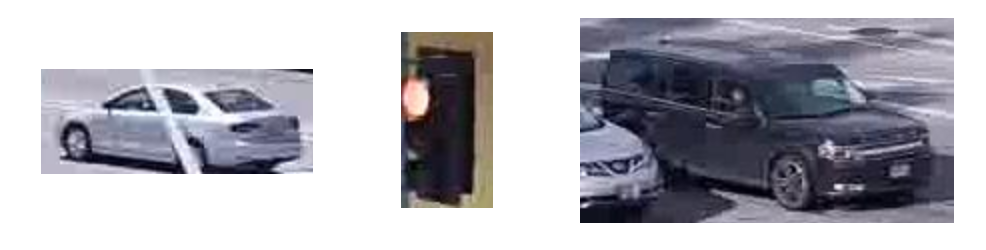

# Image Clustering

Clustering image dataset consisting of 100,000 small traffic images in different dimensions into 14 clusters.

The accuracy is measured by an external index metric `Normalized Mutual Information Score (NMI)`

## Preprocess

- Unifying dimensions based on data distribution
- Feature extraction (`VGG16` or `ResNet50`)
- Optionally apply dimensionality reduction
- Experiment with several clustering algorithms and hyperparameter tuning to find the best one

## Clustering Algorithm

- [`KMeans`](https://scikit-learn.org/stable/modules/generated/sklearn.cluster.KMeans.html)
- [`DBSCAN`](https://scikit-learn.org/stable/modules/generated/sklearn.cluster.DBSCAN.html)
- [`SpectralClustering`](https://scikit-learn.org/stable/modules/generated/sklearn.cluster.SpectralClustering.html)
- [`AgglomerativeClustering`](https://scikit-learn.org/stable/modules/generated/sklearn.cluster.AgglomerativeClustering.html)
- [`OPTICS`](https://scikit-learn.org/stable/modules/generated/sklearn.cluster.OPTICS.html)
- [`Cure`](https://codedocs.xyz/annoviko/pyclustering/classpyclustering_1_1cluster_1_1cure_1_1cure.html)
